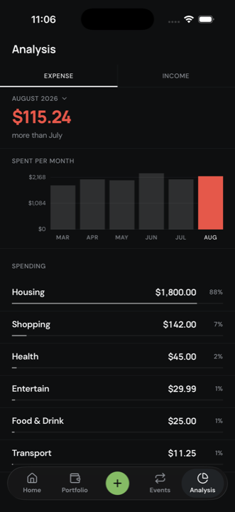

# Wise Man

A local-first personal finance app for iOS and Android. Log income and expenses in
seconds; everything stays in SQLite on the device.

## Screens

<!-- Widths are pinned because a markdown table sizes its columns by content, and
     a long heading widens its image along with it. Three to a row rather than
     six, so each one stays large enough to read. -->

| Splash                                                           | Home                                                         | Portfolio                                                              |
| ---------------------------------------------------------------- | ------------------------------------------------------------ | ---------------------------------------------------------------------- |
|  |  |  |

| Events                                                           | Analysis                                                             | Transaction                                                                |
| ---------------------------------------------------------------- | -------------------------------------------------------------------- | -------------------------------------------------------------------------- |
|  |  |  |

## Getting started

Node 20.19.4 or newer, plus Xcode or Android Studio.

```bash
npm install
npm run ios       # or npm run android
npm start         # Metro only, if the app is already installed
```

There is no web target. The first build takes a few minutes; JS changes hot-reload after
that.

**iOS build fails with `error code 70`?** Xcode downloads the iOS platform separately from
the SDK, and an update leaves the old runtime behind. Compare `xcrun simctl list runtimes`
against `xcodebuild -showsdks | grep iOS`; if the runtime is behind, run
`sudo xcodebuild -runFirstLaunch` then `xcodebuild -downloadPlatform iOS`.

## Data

- **Amounts are integer cents.** SQLite `REAL` is IEEE 754, and a ledger of floats drifts
  as it is summed.
- **Dates are `TEXT` as `YYYY-MM-DD`** — a calendar day, not an instant, so which month a
  transaction falls in never depends on a timezone. ISO text also sorts, and matches a
  month by prefix.
- **Categories are ids into `constants/categories.ts`**, not rows: a table would mean
  migrating something that never changes.
- **An account stores only its opening balance.** The rest is the ledger, summed on read —
  a stored balance could disagree with the transactions under it. A credit card starts
  negative, so debt needs no special case.
- **A transfer is two rows tagged `transfer`**, and every total skips them: $500 moved
  between your own accounts is not $500 earned and $500 spent. Nothing links the pair or
  enters them for you.
- **A recurring bill posts itself.** Every occurrence it has reached becomes an ordinary
  transaction at launch, dated the day it was due. A `last_posted_date` cursor keeps that
  idempotent, so deleting one does not bring it back — and nothing is ever overdue.

Run `npx drizzle-kit generate` after editing `db/schema.ts`. Migrations are bundled into
the JS and applied at launch. In development the `...` menu on Home loads and clears
sample data.

## Stack

Expo SDK 57 · React Native 0.86 · TypeScript · Expo Router · expo-sqlite + Drizzle ·
Zustand · StyleSheet · lucide-react-native · DM Sans + Manrope

## Conventions

See [CLAUDE.md](CLAUDE.md).
