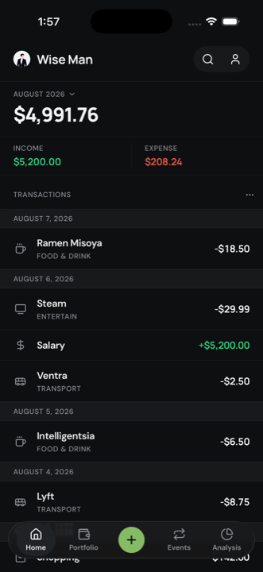
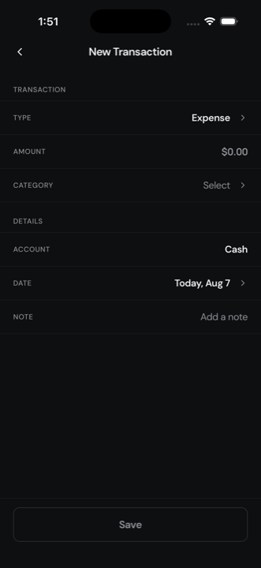
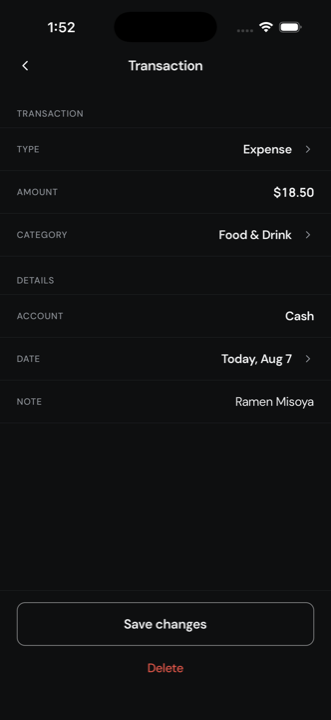

# Wise Man

A local-first personal finance app for iOS and Android. Log income and expenses in
seconds; everything stays in SQLite on the device.

## Screens

| Home                               | New transaction                      | Detail                                 |
| ---------------------------------- | ------------------------------------ | -------------------------------------- |
|  |  |  |

## Status

v1 works end to end — create, edit, delete, and it survives a restart.

| Screen                      | State       |
| --------------------------- | ----------- |
| Home, Track, Detail         | Done        |
| Portfolio, Events, Analysis | Placeholder |

Accounts are not modelled — every transaction is stored against `cash`. Search and the
profile button in the header are inert.

## Getting started

Node 20.19.4 or newer, plus Xcode or Android Studio.

```bash
npm install
npm run ios       # or npm run android
npm start         # Metro only, if the app is already installed
```

There is no web target. The first build takes a few minutes; JS changes hot-reload after
that.

**iOS build fails with `error code 70`?** Xcode downloads the iOS platform separately from
the SDK, and an update leaves the old runtime behind. Compare `xcrun simctl list runtimes`
against `xcodebuild -showsdks | grep iOS`; if the runtime is behind, run
`sudo xcodebuild -runFirstLaunch` then `xcodebuild -downloadPlatform iOS`.

## Data

- **Amounts are integer cents.** SQLite `REAL` is IEEE 754, and a ledger of floats drifts
  as it is summed — the one thing this app exists to do.
- **Dates are `TEXT` as `YYYY-MM-DD`** — the calendar day the money moved, not an instant,
  so which month a transaction falls in never depends on the reader's timezone. ISO text
  sorts chronologically and matches a month by prefix, and the column is indexed.
- **Categories are ids into `constants/categories.ts`**, not rows. They are code, and a
  table would mean seeding and migrating something that never changes.

Run `npx drizzle-kit generate` after editing `db/schema.ts`. Migrations are bundled into
the JS and applied at launch. In development the `...` menu on Home loads and clears
sample data.

## Stack

Expo SDK 57 · React Native 0.86 · TypeScript · Expo Router · expo-sqlite + Drizzle ·
Zustand · StyleSheet · lucide-react-native · DM Sans + Manrope

## Conventions

See [CLAUDE.md](CLAUDE.md).
