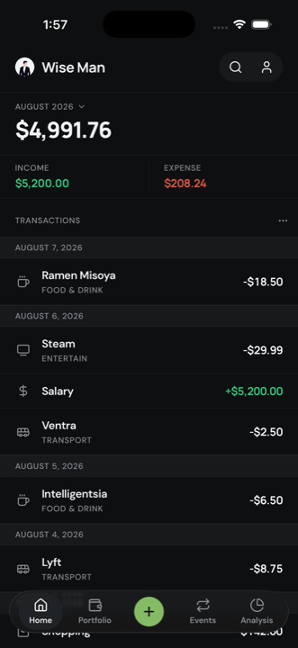
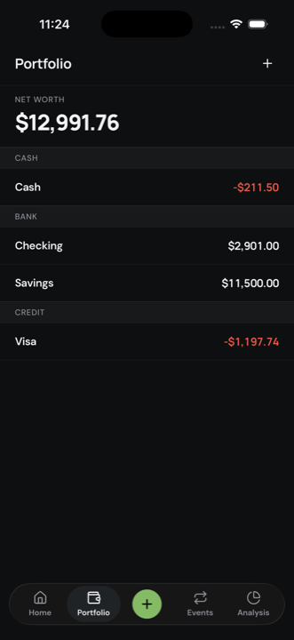
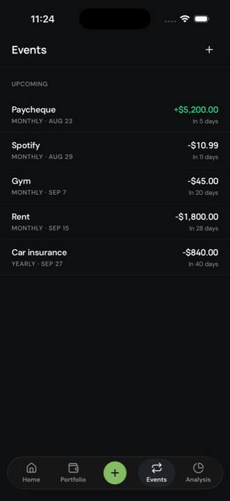
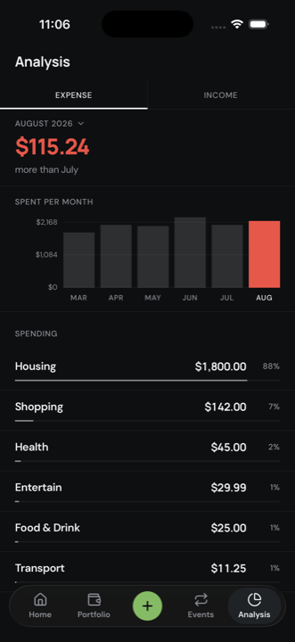
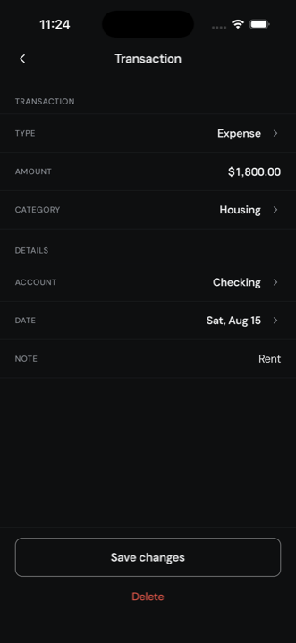

# Wise Man

A local-first personal finance app for iOS and Android: log income and expenses in
seconds, with everything kept in SQLite on the device.

<!-- Widths are pinned because a markdown table sizes its columns by content, and
     a long heading widens its image along with it. Three to a row rather than
     six, so each one stays large enough to read. -->

| Splash                                                           | Home                                                         | Portfolio                                                              |
| ---------------------------------------------------------------- | ------------------------------------------------------------ | ---------------------------------------------------------------------- |
|  |  |  |

| Events                                                           | Analysis                                                             | Transaction                                                                |
| ---------------------------------------------------------------- | -------------------------------------------------------------------- | -------------------------------------------------------------------------- |
|  |  |  |

## Features

- Log a transaction in a few taps, and search notes and categories across every month
- Track several accounts, with balances and net worth worked out from the ledger
- Recurring bills that post themselves when they come due
- Compare the month with the last, see a six-month trend, and rank spending by category
- No account, no server: the data never leaves the phone

## Tech Stack

- App: Expo SDK 57, React Native 0.86, TypeScript, Expo Router
- Data: SQLite (expo-sqlite) with Drizzle, Zustand for state
- UI: StyleSheet, lucide-react-native, DM Sans and Manrope

## Getting Started

### Prerequisites

- Node.js 20.19.4 or newer
- Xcode with an iOS simulator, or Android Studio

### Installation

```bash
git clone https://github.com/Hongda-OSU/Wise-Man.git
cd Wise-Man
npm install
```

## Usage

```bash
npm run ios       # build and launch on the iOS simulator; npm run android for Android
npm start         # Metro only, once the app is installed
```

The first build takes a few minutes; JS changes hot-reload after that. There is no web
target.

If the iOS build fails with `error code 70`, see
[docs/troubleshooting.md](docs/troubleshooting.md). Why the data is shaped as it is:
[docs/data.md](docs/data.md).
